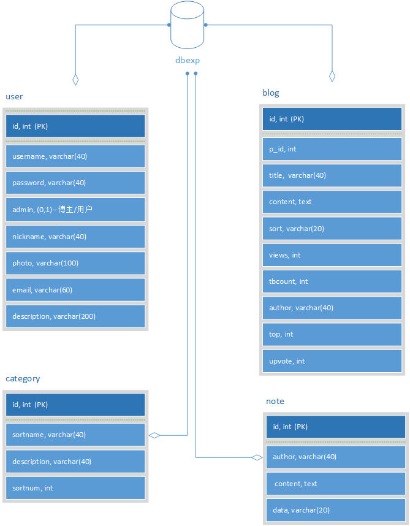

## 数据库结构设计
#### 结构图：
<div align="center">



</div>

#### user表 ($table_user=user)
用来保存博主和用户信息，创建命令：

```php
$sql="create table $table_user(
id int not null auto_increment primary key,--用户序号
username varchar(40) not null default '',-------用户名。登陆用
password varchar(40) not null default '',-------密码，md5加密
admin enum('1','0') not null default '0',-------是否是博主
nickname varchar(20) not null default '',-------昵称，前台显示
photo varchar(80) not null default '',----------头像链接
email varchar(60) not null default '',----------email
description varchar(60) not null default ''-----个性签名
)character set = utf8";//-----------------------字符设置
mysql_query($sql,$link) or die(mysql_error());
```
#### blog表 ($table_blog=blog)
用来保存博客和相应的评论内容等，根据p_id确定评论属于哪一篇博客
```php
$sql="create table $table_blog(
id int not null auto_increment primary key, --博客及评论序号
p_id int not null default 0,------------------判断博客及评论
title varchar(40) not null default '',--------博客标题
content text,---------------------------------内容
sort varchar(20) not null default '',---------标签
views int(5) not null default 0,--------------浏览量
tbcount int(5) not null default 0,------------评论量
author varchar(40) not null default '',-------作者
date varchar(20) not null default '',---------创建时间
top int not null default '0',-----------------是否置顶
upvote int not null default '0'---------------点赞量
)character set = utf8";//---------------------设置字符，支持中文
mysql_query($sql,$link) or die(mysql_error());
```
#### note表 ($table_note=note)
用来保存留言信息，可支持不登录匿名留言
```php
$sql="create table $table_note(
id int(5) not null auto_increment primary key,--留言序号
content text,-----------------------------------留言内容
author varchar(40) not null default '',---------作者，支持匿名用户
date varchar(30) not null default ''------------时间
)character set = utf8";//-----------------------字符设置
mysql_query($sql,$link) or die(mysql_error());
```
#### category表 ($table_ctg=category)
用来保存标签，统计相应的博客数量
```php
$sql="create table $table_ctg(
id int(5) not null auto_increment primary key,--标签序号
sortname varchar(20) not null default '',-------标签名
sortnum int(5) not null default 0---------------博文数量
)character set = utf8";//-----------------------字符设置
```
## 支持功能：
#### 用户相关
1. 用户注册/登录
2. 用户登录可在`设置`中管理`用户信息`，`账号安全`
3. 博主登录在`设置`中可管理`用户信息`，`账号安全`，`发表博客`，`博客管理`，`新建标签`，`标签管理`，`用户管理`。
4. 博主信息支持头像（需要头像链接）
#### 博客相关
1. 支持置顶功能（博主权限）
2. 支持点赞功能
3. 支持删除/修改功能
3. 支持html标记语言：如可插入图片/超链接等
2. 支持mathjax数学公式
3. 支持按`标签`分类查看博客
4. 支持按创建时间查看博客
5. 支持评论（支持匿名用户）
#### 留言相关
1. 支持匿名用户
2. 留言量过多时支持分页显示
#### 标签相关
1. 支持新建/修改/删除标签
2. 统计博客量
2. 删除博客时相应标签数量相应减少
#### UI
1. 全网页支持中文
2. 网页头部：网站图标/菜单
3. 网页底部：友情链接
4. 左边栏：博主信息/标签/归档/登录信息
5. 主页：显示置顶博客及最近时间博客，显示最近留言
